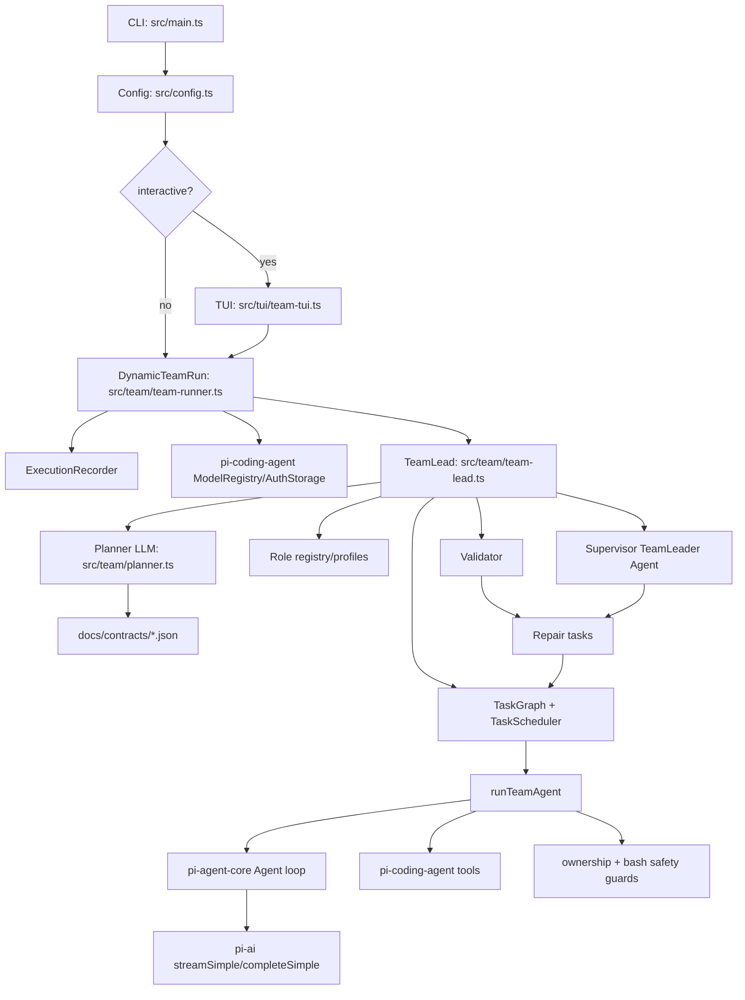
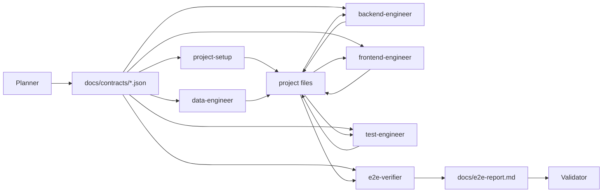

# agent-team 项目架构与默认任务流转

> 本文基于当前源码整理，重点解释 `packages/agent-team` 以及它依赖的底层框架 `pi-agent-core`、`pi-coding-agent`、`pi-ai`、`pi-tui` 如何协作。

## 一个类比

可以把 `agent-team` 想成一家软件施工队：

- `main.ts` 是前台，接收客户需求和配置。
- `TeamRun` 是项目经理办公室，负责创建项目目录、记录事件、处理暂停和审批。
- `TeamLead` 是调度器，负责规划、派工、验收、返工。
- `Planner` 是总设计师，用 LLM 把自然语言需求拆成角色、任务、契约。
- 各个 worker agent 是具体工种，按任务写代码、跑自测、提交 handoff。
- `Validator` 是质检员，检查文件、契约、语法、脚本、测试和 E2E 报告。
- `Supervisor TeamLeader Agent` 是语义审查员，只在里程碑检查，不直接写代码。
- `ExecutionRecorder` 是项目档案员，把所有事件按全局顺序写入 JSONL 和摘要。

## 总体架构



## 包职责边界

### `packages/agent-team`

这是多 Agent 项目编排层。它不实现底层 LLM agent 循环，而是负责：

- 从用户需求生成项目计划。
- 固化协作契约。
- 创建角色配置。
- 按 DAG 调度任务。
- 接入 worker agent。
- 统一收集事件和执行记录。
- 做验证和返工闭环。
- 提供 CLI/TUI/API 入口。

核心文件：

| 文件 | 职责 |
| --- | --- |
| `src/main.ts` | CLI 参数解析、配置合并、默认启动 TUI |
| `src/config.ts` | 查找 `agent-team.json`，合并 CLI 和文件配置 |
| `src/types.ts` | TeamConfig、TeamEvent、TeamPlan、TaskResult 等公共类型 |
| `src/team/team-runner.ts` | `createTeamRun()`、项目目录、模型解析、审批/暂停/终止控制、执行记录 |
| `src/team/team-lead.ts` | 主编排：规划、调度、验证、supervisor、repair loop |
| `src/team/planner.ts` | LLM planner、planner JSON 校验、契约写入、repair task 生成 |
| `src/roles/role-profiles.ts` | 内置闭集角色 profile |
| `src/roles/system-prompts.ts` | 从 role profile + 权限模式生成 worker system prompt |
| `src/agent/team-agent.ts` | 单个 worker agent 的运行适配层 |
| `src/agent/tool-pool.ts` | 从 `pi-coding-agent` 构建 read/write/edit/bash/grep/find/ls 工具 |
| `src/agent/bash-safety.ts` | bash 风险分类、审批策略、阻断逻辑 |
| `src/agent/file-ownership.ts` | owned 模式下的写路径归属检查 |
| `src/team/validator.ts` | 静态验证、运行时验证、handoff/checksRun 验证 |
| `src/team/supervisor.ts` | Supervisor TeamLeader Agent 的里程碑审查 |
| `src/team/execution-recorder.ts` | `events.jsonl`、任务分片、`run-summary.md` |
| `src/tui/team-tui.ts` | 终端进度面板、审批按键、任务表、日志 |

### `packages/agent` / `@mariozechner/pi-agent-core`

这是底层单 Agent 运行时。`agent-team` 的每个 worker 本质上都是一个 `Agent` 实例。

它负责：

- 保存 agent state：system prompt、model、tools、messages、streaming 状态。
- 调用 `streamFn` 请求 LLM。
- 处理 LLM 的 tool call。
- 执行 tool 前调用 `beforeToolCall`。
- 执行 tool 后生成 `toolResult` 消息。
- 发出 `AgentEvent`：`message_start`、`message_end`、`tool_execution_start`、`tool_execution_end`、`turn_end` 等。
- 支持 `abort()`、`steer()`、`followUp()`、上下文 transform。

关键点：

```text
Agent.prompt(taskDescription)
  -> runAgentLoop()
  -> streamAssistantResponse()
  -> LLM returns text/tool calls
  -> beforeToolCall()
  -> execute tool
  -> emit tool result
  -> next turn if more tool calls
  -> agent_end
```

### `packages/coding-agent` / `@mariozechner/pi-coding-agent`

`agent-team` 复用了这里的编码工具和模型/认证能力：

- `createReadTool`
- `createWriteTool`
- `createEditTool`
- `createBashTool`
- `createGrepTool`
- `createFindTool`
- `createLsTool`
- `convertToLlm`
- `AuthStorage`
- `ModelRegistry`

这里的 bash 工具会在项目目录下启动本地 shell，并支持超时、输出截断、进程树终止。`agent-team` 在这个 bash 工具外面再包了一层自己的风险分类和审批策略。

### `packages/ai` / `@mariozechner/pi-ai`

这是模型 API 层，负责：

- 注册不同 provider 的 stream 实现。
- 提供 `streamSimple()` 和 `completeSimple()`。
- 把 `Model.api` 路由到具体 provider。
- 返回标准化的 assistant message event stream。

`agent-team` 中：

- Planner 和 Supervisor 用 `completeSimple()`，因为它们需要一次性 JSON 输出。
- Worker agent 用 `streamSimple()`，因为它们需要流式工具调用和多轮执行。

### `packages/tui` / `@mariozechner/pi-tui`

TUI 层用于终端监控。`agent-team` 的 `TeamRunComponent` 订阅 `TeamEvent`，把事件归约为：

- 当前状态。
- 输出目录。
- 模型和并发数。
- 任务表。
- 当前工具调用。
- validation/repair/supervision 状态。
- 审批队列。
- 最近日志。

## 内置 Agent 角色

Planner 不能任意生成系统提示词、工具、maxTurns 或模型配置，只能从内置 profile 里选择角色。

| Profile | 职责边界 | 默认工具 | 默认 turns |
| --- | --- | --- | --- |
| `project-setup` | 项目骨架、package/config/scripts、基础目录 | read/write/edit/bash/grep/find/ls | 200 |
| `backend-engineer` | API、server、路由、后端业务逻辑 | read/write/edit/bash/grep/find/ls | 200 |
| `data-engineer` | schema、persistence、seed/domain data | read/write/edit/bash/grep/find/ls | 200 |
| `frontend-engineer` | UI、client state、app shell、浏览器行为 | read/write/edit/bash/grep/find/ls | 200 |
| `test-engineer` | 单元测试和集成测试，不做最终 E2E | read/write/edit/bash/grep/find/ls | 200 |
| `e2e-verifier` | 最终端到端验证，写 `docs/e2e-report.md` | read/write/edit/bash/grep/find/ls | 200 |
| `docs-engineer` | 使用文档、交付说明、handoff docs | read/write/edit/grep/find/ls | 200 |

当前默认配置是更开放的测试模式：

- `permissionMode: "open"`：ownedDirectories 主要用于职责和 repair routing，不强制限制写路径。
- `executionMode: "open"`：允许 agent 运行完成任务和自测所需命令。
- `approvalPolicy: "minimal"`：safe/medium 命令自动放行，high 风险命令才审批或阻断。
- 当前运行目录的 `agent-team.json` 设置了 `supervisionMode: "milestone"`：直接启动会默认启用 Supervisor TeamLeader Agent。

如果后续要恢复严格边界，可以使用：

```bash
node dist/main.js "需求" --permission-mode owned --execution-mode restricted --approval-policy strict
```

## Agent 如何通信和共享上下文

Agent 之间没有直接私聊通道。系统采用“契约文件 + 实际文件 + 事件日志”的共享上下文。



每个 worker 的 task prompt 都包含：

- 用户原始需求。
- Team plan summary。
- 当前角色描述。
- 具体 task description。
- 必须先读的 contract 文件路径。
- owned paths。
- expected outputs。
- acceptance criteria。
- 自测要求。
- 人工 intervention 记录。

worker 完成后还会写：

```text
docs/agent-team/tasks/<taskId>-handoff.json
```

handoff 内容包含：

- changedFiles
- contractsSatisfied
- checksRun
- knownRisks

这些内容会被 Validator 和 Supervisor 读取，用于判断产出质量和返工路由。

## 默认启动一次任务的完整流转

以这个命令为例：

```bash
node dist/main.js "创建一个 Markdown 笔记 API 服务：Express + SQL.js 持久化。支持创建/编辑/删除笔记，Markdown 渲染为 HTML，按标签分组，全文搜索。前端用单页展示。包含 API 测试和 e2e 验证。"
```

### 1. CLI 解析

`src/main.ts` 的 `parseArgs()` 读取参数。当前源码里默认：

```ts
const result: ParsedArgs = { interactive: true };
```

所以不加 `--no-interactive` 时，会默认进入 TUI。

配置优先级：

```text
CLI 参数 > ./agent-team.json > ~/.pi/agent-team.json > 内置默认值
```

最终形成 `TeamConfig`，包括：

- requirement
- outputDir
- model provider/model/apiKey/baseUrl
- maxParallelAgents
- thinkingLevel
- interventionMode
- supervisionMode
- permissionMode
- executionMode
- approvalPolicy
- maxRepairRounds

注意：源码内置默认 `supervisionMode` 是 `off`，但当前包目录存在 `agent-team.json`，其中设置了：

```json
{
  "supervisionMode": "milestone"
}
```

所以从当前目录直接启动时，Supervisor TeamLeader Agent 会默认开启。若要临时关闭，可传：

```bash
node dist/main.js "需求" --supervision-mode off
```

### 2. 创建 TeamRun

如果 interactive 为 true：

```text
runTeamTui(config)
  -> createTeamRun(config)
  -> new TeamRunComponent(run)
  -> run.subscribe(event => component.push(event))
  -> tui.start()
  -> run.start()
```

如果 `--no-interactive`：

```text
runTeam(config)
  -> createTeamRun(config).start()
```

### 3. 准备输出目录和执行记录

`DynamicTeamRun.start()` 会：

1. 根据需求生成 slug。
2. 在 `outputDir` 下创建唯一项目目录。
3. 初始化 `ExecutionRecorder`。
4. 创建 `AuthStorage`。
5. 创建 `ModelRegistry`。
6. 解析模型。
7. 创建 `TeamLead`。

例如输出目录可能是：

```text
output/markdown-api-express-sqljs/
```

执行记录会写到：

```text
output/markdown-api-express-sqljs/docs/agent-team/events.jsonl
output/markdown-api-express-sqljs/docs/agent-team/tasks/<taskId>.jsonl
output/markdown-api-express-sqljs/docs/agent-team/run-summary.md
```

### 4. TeamLead 发出 run_start

`TeamLead.orchestrate()` 首先 emit：

```text
run_start
```

这个事件会同时进入：

- TUI
- 订阅者
- ExecutionRecorder

### 5. Planner 生成团队计划

`llmPlannerRunner()` 调用 `completeSimple()`，要求 LLM 只返回 JSON。

Planner 必须输出：

- `teamPlan.roles`
- `teamPlan.tasks`
- `teamPlan.validationRules`
- `projectManifest`
- 可选 `openapi`
- 可选 `dataModel`
- 可选 `notes`

它只能选择内置 profile，不能输出：

- `allowedTools`
- `systemPrompt`
- `maxTurns`
- `modelOverride`
- `thinkingLevelOverride`

并且必须创建恰好一个最终 `e2e-verifier` task。

这个需求可能被拆成类似任务：

| 顺序 | 任务 | Profile | 依赖 |
| --- | --- | --- | --- |
| 1 | 初始化 Express + SQL.js 项目 | `project-setup` | 无 |
| 2 | 设计 note/tag/search 数据结构 | `data-engineer` | 1 |
| 3 | 实现 notes API 和 Markdown render | `backend-engineer` | 1,2 |
| 4 | 实现单页前端 | `frontend-engineer` | 1,3 |
| 5 | 编写 API 测试 | `test-engineer` | 3 |
| 6 | 端到端验证服务和前端流程 | `e2e-verifier` | 2,3,4,5 |
| 7 | 编写使用说明 | `docs-engineer` | 6 |

### 6. 写入契约文件

Planner 成功后，`writeContracts()` 写入：

```text
docs/contracts/team-plan.json
docs/contracts/project-manifest.json
docs/contracts/openapi.json
docs/contracts/data-model.json
docs/contracts/notes.json
```

然后 emit：

```text
plan_created
```

### 7. 可选 Supervisor 审查计划

如果配置：

```json
{ "supervisionMode": "milestone" }
```

TeamLead 会在 `plan_created` 后触发 supervisor：

```text
supervision_start(plan_created)
supervision_end(plan_created)
```

Supervisor 不写业务代码，只读事实源并输出结构化 JSON 决策：

- `accept`
- `warn`
- `request_repair`
- `request_human`

在当前包目录中，`agent-team.json` 已默认配置为 `milestone`，所以直接运行会进入这一步。只有显式传 `--supervision-mode off`，或使用未设置该字段的其他配置文件时，才会跳过 Supervisor。

### 8. 创建角色注册表

`createRoleRegistry(plan, permissionMode, executionMode)` 把 planner 的 `RoleSpec` 合成为运行时 `RoleDefinition`。

合成时：

- `profile` 决定 system prompt。
- `profile` 决定 allowedTools。
- `profile` 决定 maxTurns。
- `profile` 决定 thinkingLevelOverride。
- planner 只保留动态的 name/description/ownedDirectories。

### 9. 构建任务图并调度

`TaskGraph` 存储任务和依赖。`TaskScheduler` 按 `maxParallelAgents` 取 ready batch。

```text
batch 1: project-setup
batch 2: data-engineer
batch 3: backend-engineer
batch 4: frontend-engineer + test-engineer
batch 5: e2e-verifier
batch 6: docs-engineer
```

如果两个任务依赖都满足，且并发槽位足够，就会并行执行。

### 10. Worker Agent 执行任务

每个 task 会进入 `runTeamAgent(taskDescription, agentConfig)`。

Worker agent 初始化内容：

- `systemPrompt`: 来自 role profile 和权限/执行模式。
- `model`: TeamRun 解析出的模型。
- `thinkingLevel`: role override 或全局配置。
- `tools`: 由 `buildToolPool()` 创建。
- `beforeToolCall`: ownership guard + bash safety guard。
- `transformContext`: contract-aware context transform。

执行过程：

```text
agent.prompt(taskDescription)
  -> LLM 读取任务
  -> tool call: read docs/contracts/team-plan.json
  -> tool call: write/edit 代码
  -> tool call: bash 自测
  -> 最终 assistant 文本
  -> 写 handoff JSON
  -> 返回 TaskResult
```

如果 agent 空回复且没有改文件，当前逻辑会把它标记为失败：

```text
Agent <role> produced an empty response and changed no files.
```

这样不会把空产出误当成功。

### 11. 工具权限和审批

工具来自 `pi-coding-agent`：

- read
- write
- edit
- bash
- grep
- find
- ls

权限由三层控制：

| 配置 | 默认 | 作用 |
| --- | --- | --- |
| `permissionMode` | `open` | `open` 不强制 owned path；`owned` 强制 write/edit 只能在 ownedDirectories 内 |
| `executionMode` | `open` | `open` 允许完成任务所需命令；`restricted` 提示 agent 少跑安装/长驻命令 |
| `approvalPolicy` | `minimal` | `minimal` 只审批 high；`strict` 审批 medium/high |

bash 风险分类：

| 等级 | 默认行为 | 示例 |
| --- | --- | --- |
| `safe` | 自动放行 | `node --check`、`npm test`、本地 HTTP 检查 |
| `medium` | minimal 自动放行，strict 审批 | `npm install`、`npx`、`npm run start` |
| `high` | approval/interactive 下审批；none 下阻断 | `rm`、外网 `curl`、`curl | bash`、`chmod`、`docker up`、命令替换 |

同一次 run 内，如果用户批准过同一个 high 风险 approval key，后续同 key 自动复用批准。

### 12. 任务结束和 handoff

每个 task 结束后 emit：

```text
task_end
```

TaskResult 包含：

- taskId
- success
- output
- filesCreated
- error
- turnsUsed
- checksRun
- handoffPath

同时写：

```text
docs/agent-team/tasks/<taskId>-handoff.json
```

### 13. Validator 验收

所有当前任务完成后，TeamLead emit：

```text
validation_start
```

然后 `validateTeamOutputWithChecks()` 执行：

1. 必需 contract 是否存在。
2. 每个 task 的 expectedOutputs 是否存在。
3. `package.json` 是否有效且有有用 scripts。
4. OpenAPI path 是否在实现中体现。
5. E2E report 是否包含 commands、exit status、observed result、acceptance status。
6. 每个非 docs task 是否有 handoff。
7. 每个非 docs task 是否报告自测 checksRun。
8. JS 文件 `node --check`。
9. 需要时 `npm install`。
10. 安全 package script 的 `npm run check` / `npm test` / `npm run build`。

结束后 emit：

```text
validation_end
```

### 14. 可选 Supervisor 审查验证结果

`supervisionMode=milestone` 时，Supervisor 会在：

- `plan_created`
- 每个 `task_end`
- `validation_end`
- `final_review`

这些 checkpoint 审查事实源。

它读取：

- TeamPlan
- recent TeamEvent
- contracts
- handoff JSON
- changed files
- validation issues
- checksRun

它的 blocking `request_repair` issue 会进入现有 repair loop，但实际调度仍由 deterministic TeamLead 执行。

### 15. Repair loop

如果 validation/supervisor 产生 error 级 issue，TeamLead 会：

1. 检查是否超过 `maxRepairRounds`。
2. 调用 `createRepairTasks(plan, issues, round)`。
3. 优先按 `ownerTaskId` 路由。
4. 其次按 issue file 匹配 task owned paths。
5. 最后 fallback 到可用任务，并在 issue message 中记录 warning。
6. emit `repair_requested`。
7. emit `plan_updated`。
8. 重新调度 repair tasks。

repair task 的 description 会附加上一轮失败原因，并明确要求：

```text
Do not finish with an empty response or zero file changes.
```

### 16. 结束

没有 blocking issue 时，TeamLead emit：

```text
run_end
```

`ExecutionRecorder.finish()` 写：

```text
docs/agent-team/run-summary.md
```

CLI 最后打印：

```text
=== Team Result ===
Success: true/false
Output directory: ...
Total turns: ...
Tasks completed: ...
Validation issues: ...
```

## 默认事件顺序

典型成功路径：

```text
run_start
plan_created
task_start
agent_event...
task_progress...
task_end
task_start
agent_event...
task_end
validation_start
validation_end
run_end
```

带 repair 的路径：

```text
run_start
plan_created
task_start/task_end...
validation_start
validation_end
repair_requested
plan_updated
task_start/task_end...
validation_start
validation_end
run_end
```

带 supervisor 的路径会额外出现：

```text
supervision_start
supervision_end
```

带审批的路径会额外出现：

```text
approval_requested
approval_resolved
```

## 最终产物结构示例

```text
output/markdown-api-express-sqljs/
  docs/
    contracts/
      team-plan.json
      project-manifest.json
      openapi.json
      data-model.json
      notes.json
    agent-team/
      events.jsonl
      run-summary.md
      team-leader-review.md
      supervision/
        001-plan_created.json
      tasks/
        setup.jsonl
        setup-handoff.json
        backend.jsonl
        backend-handoff.json
    e2e-report.md
  package.json
  src/
    ...
  tests/
    ...
```

## 关键注意点

1. 默认现在会启动 TUI。要禁用 TUI，用 `--no-interactive`。
2. 当前本地配置默认开启 Supervisor：`supervisionMode=milestone`。要禁用，用 `--supervision-mode off`。
3. 默认权限不是严格隔离，而是 `permissionMode=open`。这符合当前“先让 E2E 能跑通”的测试目标。
4. 真正恢复隔离时，要同时考虑 `permissionMode=owned`、`executionMode=restricted`、`approvalPolicy=strict`。
5. Agent 之间不要依赖自然语言摘要。系统提示已经要求它们读取 contract 和实际文件。
6. 质量门的核心不是 agent 自称完成，而是 `checksRun`、handoff、Validator、E2E report 和 Supervisor 共同闭环。
7. Supervisor TeamLeader Agent 不直接调度或修改代码；它只能提出结构化建议，实际执行仍由 TeamLead 调度器完成。
